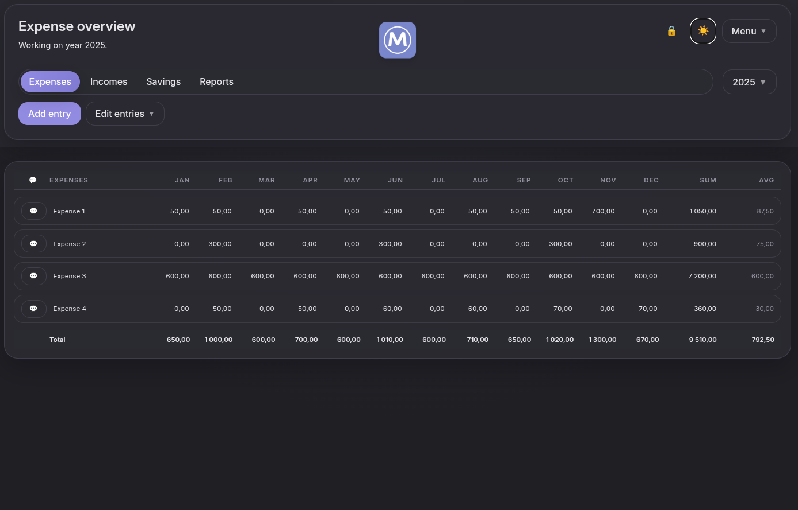
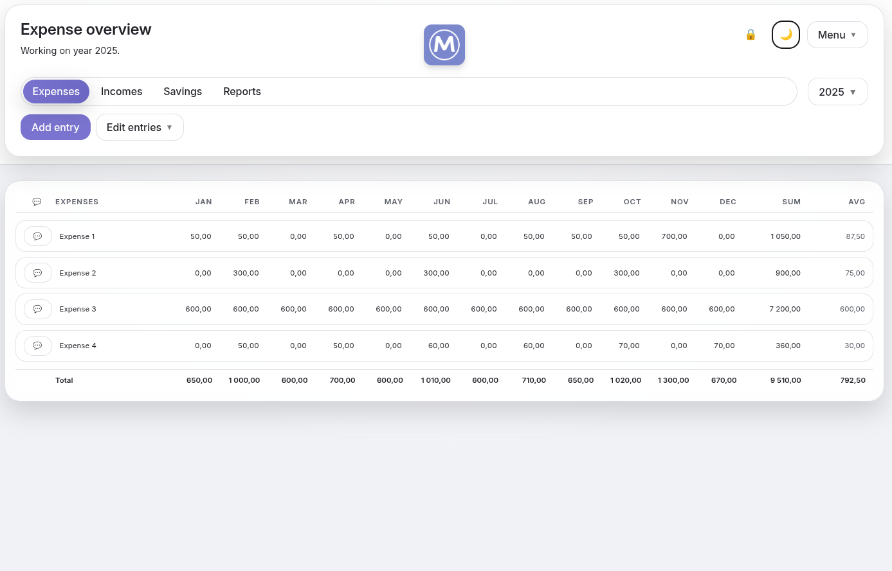
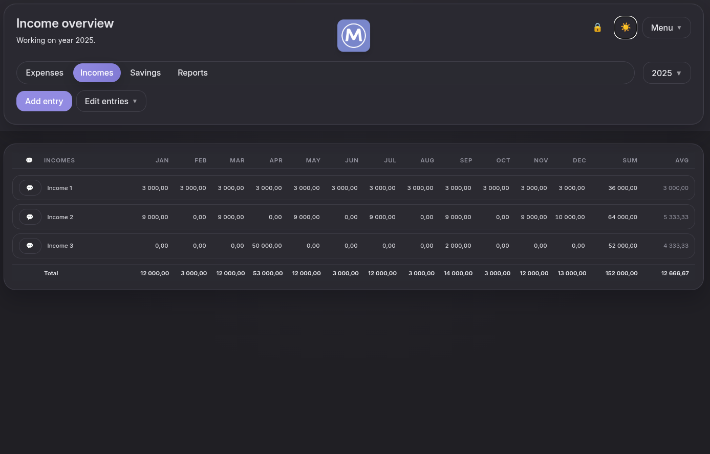
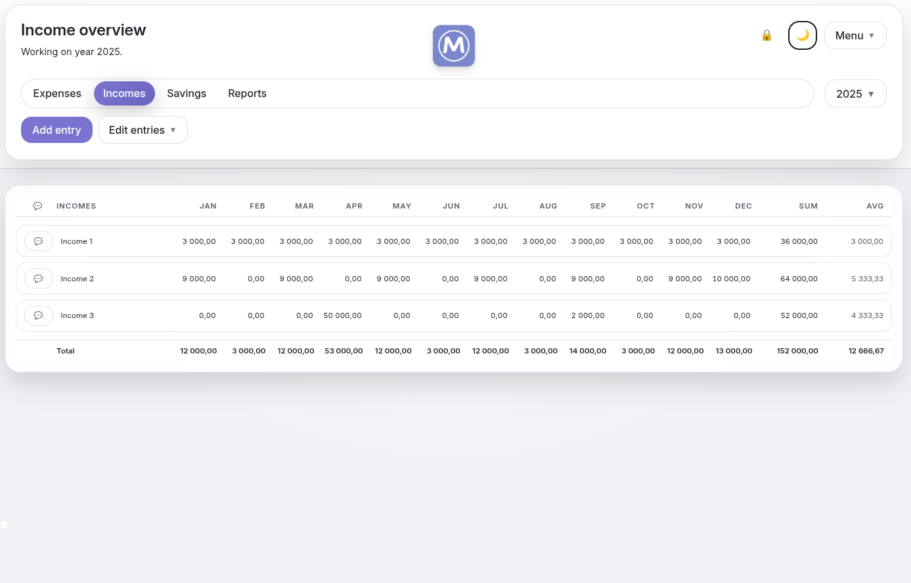
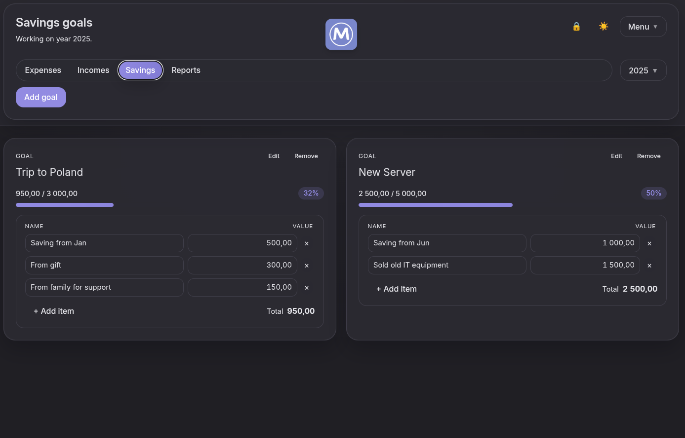
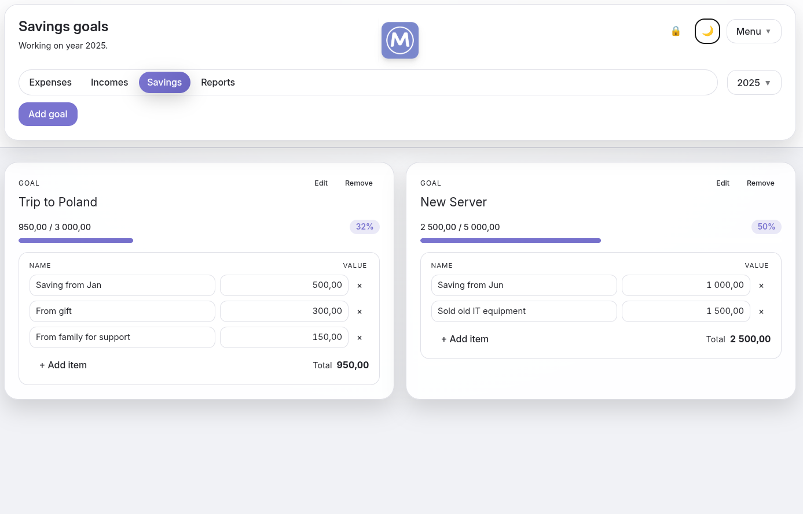
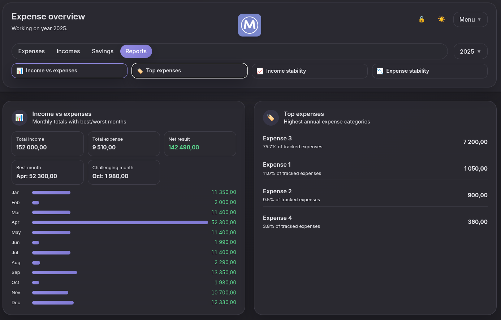
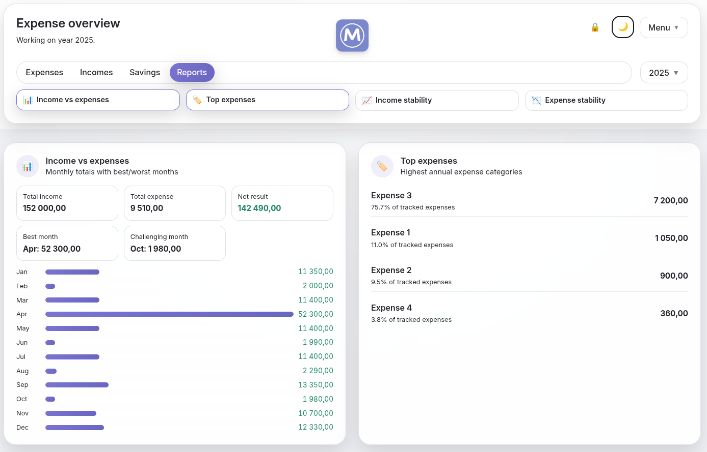
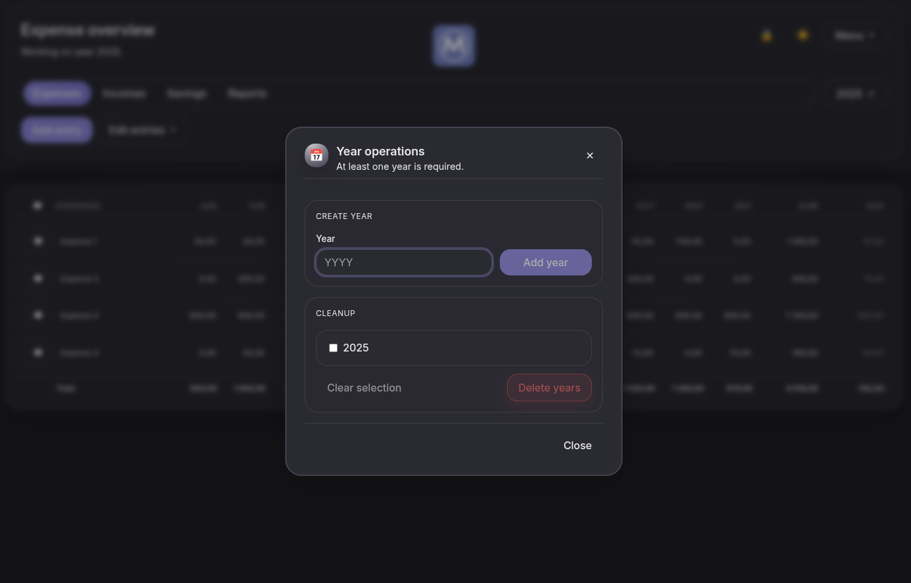
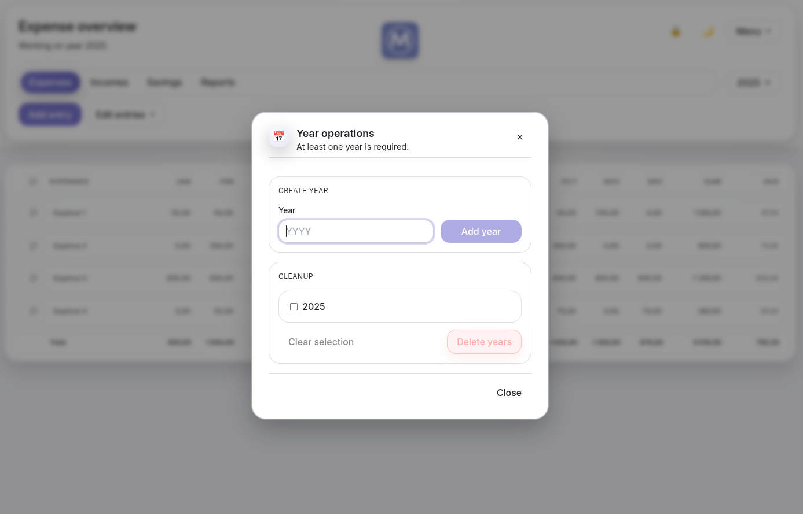

# MOPAY

<p align="center">
  
</p>


**MOPAY** to samohostowalna aplikacja do zarządzania finansami osobistymi / domowym budżetem.

- ✅ Nowoczesny interfejs (React + Vite + Tailwind)
- ✅ Backend API (Node.js)
- ✅ PWA – działa jak natywna aplikacja, tryb offline
- ✅ Obsługa wielu lat, wpisów, raportów, celów oszczędnościowych
- ✅ Przyjazny dla self-hostingu (Docker, docker-compose, reverse proxy)

---
<!--
## Demo / screenshoty











-->
## Demo / screenshoty

#Main UI
<p align="center">
  
  
</p>
<p align="center">
  
  
</p>

#Savings
<p align="center">
  
  
</p>

#Reports
<p align="center">
  
  
</p>

#Settings
<p align="center">
  
  
</p>

<p></p>

---

## Funkcje

- Zarządzanie **latami rozliczeniowymi**
- Dodawanie, edycja i usuwanie **wpisów przychodów i wydatków**
- **Raporty** i podsumowania
- **Cele oszczędnościowe** i śledzenie postępu
- **PIN guard** (blokada dostępu)
- Tryb **offline** (PWA, cache zasobów)

---

## Uruchomienie – Docker (GHCR)

Najprostszy sposób na start: użyć gotowego obrazu z GitHub Container Registry.

```bash
docker run -d \
  --name mopay \
  -p 8010:8010 \
  ghcr.io/<twoj-user>/<twoje-repo>:latest
