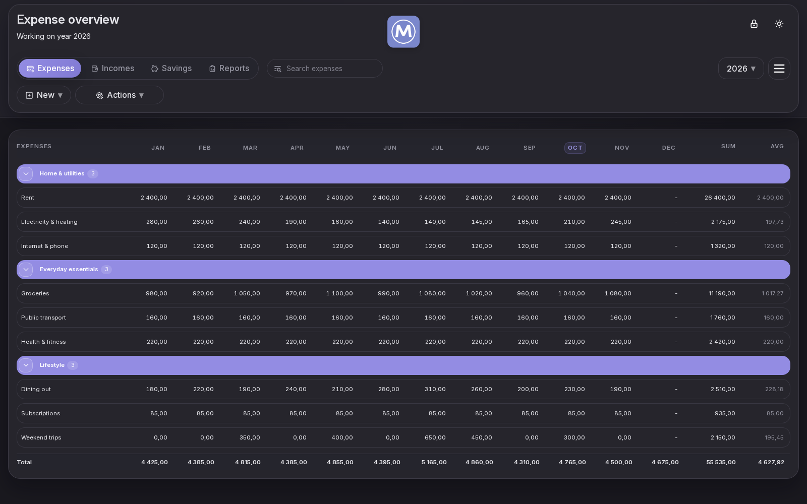
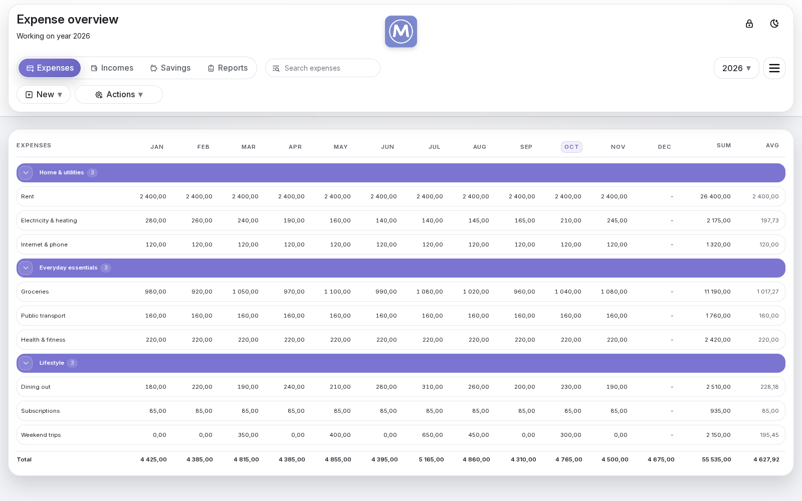
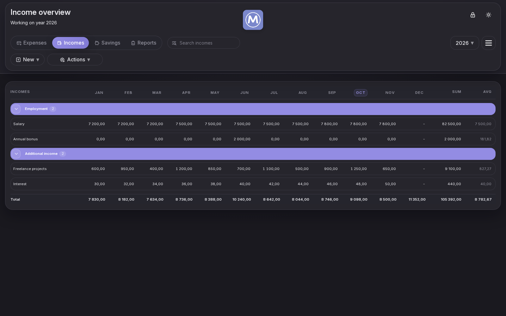
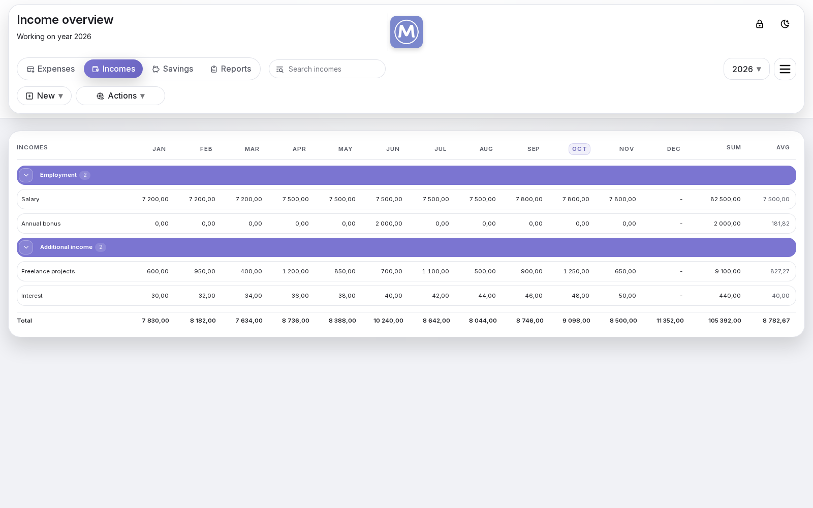
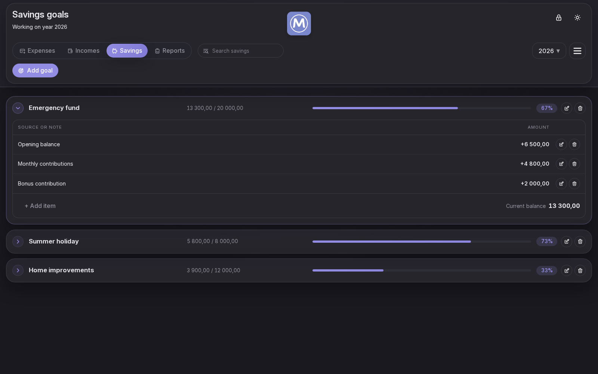
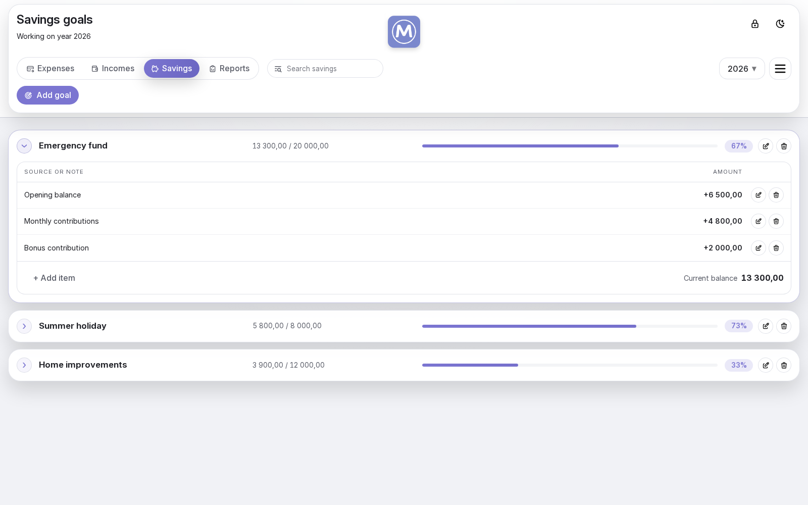
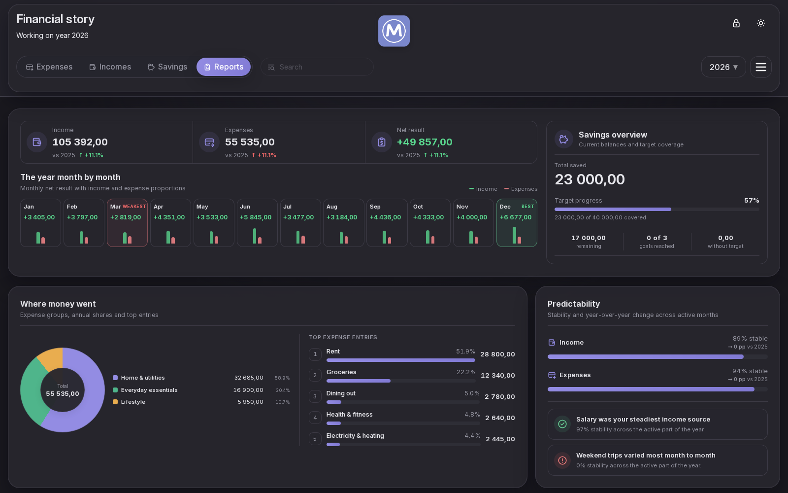
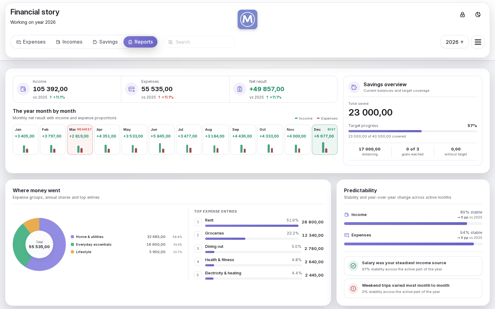
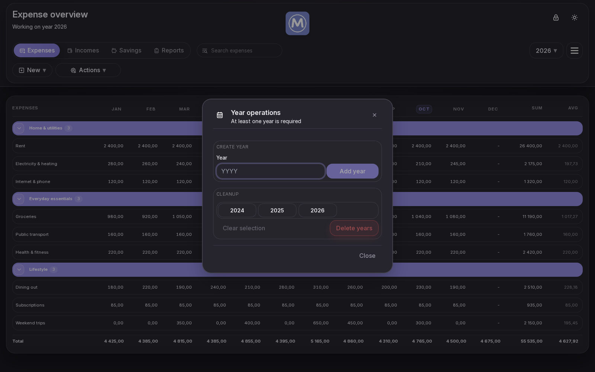
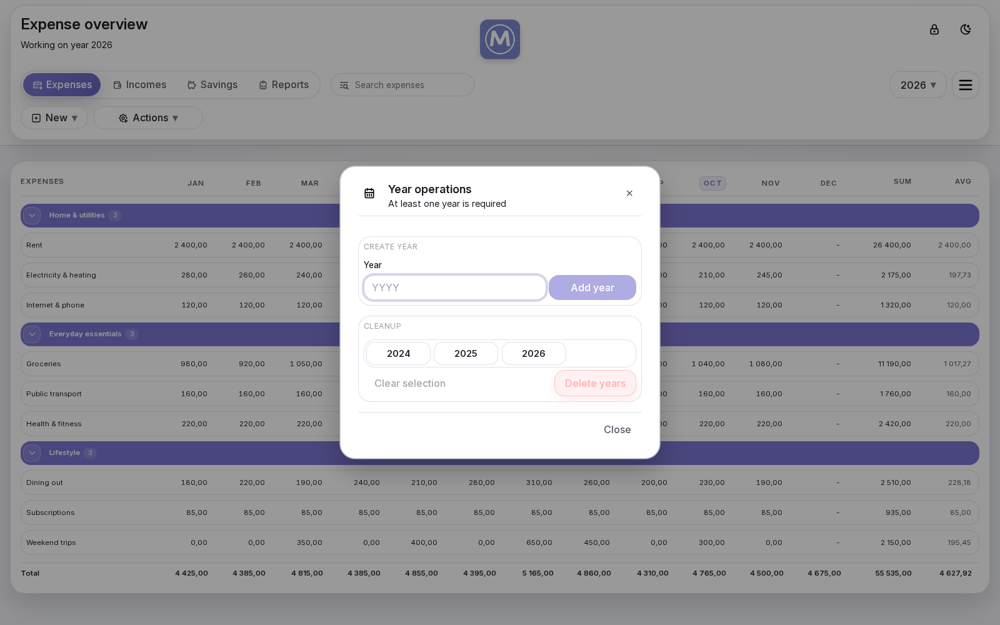

# MOPAY

<p align="center">
  
</p>


**MOPAY** is a self-hosted personal finance and home monthly payments management application.

- ✅ Modern UI (React + Vite + Tailwind)
- ✅ Backend API (Node.js)
- ✅ PWA – works offline and behaves like a native app
- ✅ Manage multiple years, entries, entry groups, reports, and savings goals
- ✅ Designed for self-hosting (Docker, docker-compose, reverse proxy friendly)
- ✅ Secured with encryption key
- ✅ PIN session protection for frontend and backend API
- ✅ Tagging - tag month with color and text to quickly identify needed informations
- ✅ Import - speedup on Mopay implementation by preparing data in excel and simply import entire year to mopay
- ✅ Release status indicator with GitHub release check

---
## Demo / Screenshots

### Main UI
<p align="center">
  
  
</p>
<p align="center">
  
  
</p>

### Savings
<p align="center">
  
  
</p>

### Reports
<p align="center">
  
  
</p>

### Year operations
<p align="center">
  
  
</p>

---

## Features

- Manage **financial years**
- Add, edit, reorder, group, and delete **income and expense entries**
- Generate **reports and summaries**
- Track **savings goals** and progress
- **Entry groups** for better table organization in incomes and expenses
- **PIN guard** built-in with backend API session protection via `X-Mopay-Session`
- **Offline** mode (PWA, asset caching)
- **Data encryption** - your incomes and expeneses values are secured with encryption key
- **Tagging** on board - tag element with color and comment
- :fire:**Import feature**  use new function for **faster data input** or financial data **migration collected in excel sheets**. Import flow with template download, validation, year overwrite confirmation, and progress/status feedback.
- **Import scope** includes entries, groups, month tags, savings goals, and savings items
- **Release info** in settings with update check against GitHub Releases

---

## Run with Docker (GHCR)

The easiest way to get started is to use compose file:

Full descriptions of environment variables and optional settings are in [Configuration](docs/CONFIGURATION.md).

Notes:
- `ghcr.io/pbuzdygan/mopay:latest` tracks releases from `main`.
- `ghcr.io/pbuzdygan/mopay:dev_latest` tracks releases from `dev`.

```bash
services:
  mopay:
    image: ghcr.io/pbuzdygan/mopay:latest
    container_name: mopay
    restart: unless-stopped
    security_opt:
      - no-new-privileges:true

# MOPAY backend/frontend listens on port 8010 inside the container
    ports:
      - "8010:8010"

# Persistent data (if backend writes anything to /data)
    volumes:
      - ./data:/data

# Environment variables
    environment:
#      - PORT=8010 #in network_mode host You can set different than default port
      - DB_FILE=/data/mopay.sqlite
      # Optional storage owner (defaults to 1000:1000):
      # - PUID=1000
      # - PGID=1000
      - APP_PIN=123456 #PIN 4-8 digits
      - APP_ENC_KEY=REPLACE_WITH_YOUR_KEY
      - NODE_ENV=production
      # Use only behind one trusted reverse-proxy hop (for example Nginx Proxy Manager):
      # - APP_TRUST_PROXY=1
      # - CORS_ALLOWED_ORIGINS=https://mopay.example.com
      # Optional security settings: see docs/CONFIGURATION.md


# Health check (optional but recommended)
#    healthcheck:
#      test: ["CMD", "curl", "-f", "http://localhost:8010"]
#      interval: 30s
#      timeout: 5s
#      retries: 5
```
### Generate Your APP_ENC_KEY

Result of below command is Your encryption key - store it securely - without it, Your Mopay will not start and Your data will be lost.

```bash
openssl rand -base64 32

```

Accepted formats:

- raw base64 output from `openssl rand -base64 32`
- `base64:<value>`

## Import notes

Download the Mopay template and keep its name `mopay_import_template.xlsx`. See [Import and export](docs/IMPORT_EXPORT.md) for the supported data, overwrite behavior and limits.

## Release check

Settings shows release/update information. See [release checks and metadata configuration](docs/CONFIGURATION.md#release-check), including the browser network requirement.

<a id="security-environment-variables-v153"></a>

## Environment variables

The **full environment-variable reference**, including defaults, security options and release metadata, is in [Configuration](docs/CONFIGURATION.md). See [basic variables](docs/CONFIGURATION.md#basic-environment-variables) and [security environment variables (v1.5.3+)](docs/CONFIGURATION.md#security-environment-variables-v153).

## Backend regression tests

Commands, fixture isolation, coverage and failure behavior are documented in [Testing](docs/TESTING.md#backend-regression-tests).

## XLSX import limits

Workbook size/structure limits, parsing budgets and error responses are listed in [Import and export](docs/IMPORT_EXPORT.md#xlsx-import-limits).

## Automated security checks

CI gates and their scope are documented in [Security](docs/SECURITY.md#automated-security-checks). The separate [container assessment](docs/CONTAINER_SECURITY.md) covers OS findings and remediation.

## Deployment notes

### Browser security headers

Serve the UI and API through the same browser origin. See [browser security headers](docs/SECURITY.md#browser-security-headers) for CSP, framing protection, proxy requirements and PWA updates.

- API JSON is parsed only after session authentication, except for the PIN endpoint, which has a `2 KB` limit. Normal authenticated API requests have a `64 KB` limit; authenticated import requests retain the `10 MB` limit. Export response size is unaffected.
- Mopay runs without root privileges, using UID/GID `1000:1000` by default. Set `PUID` and `PGID` in Compose to select another storage owner; see [storage ownership configuration](docs/CONFIGURATION.md#storage-ownership-uidgid).
- Startup entrypoint repairs `/data` ownership, drops privileges to the selected UID/GID and checks database write access.
- The runtime image uses existing Debian `setpriv` for privilege dropping and omits npm/Yarn and unused system SQLite. Dependencies are installed during build; run the service with `node server.js`. The reviewed Node 24.21.0 base is digest-pinned; available same-release Debian updates are applied during runtime build. See the [container assessment](docs/CONTAINER_SECURITY.md) for rebuild/scan commands and remaining vendor advisories.
- For production, keep persistent storage mounted only for `/data`.
- Bind-mounted `./data` must be writable by the configured UID/GID.
- Avoid sharing one SQLite file between multiple Mopay instances.
- Avoid NAS/sync folders for the live database when possible, because SQLite lock contention will degrade reliability.
- If logs show `SQLITE_READONLY`, repair host permissions once and restart:
  - `sudo chown -R 1000:1000 ./data && sudo chmod -R u+rwX ./data` (replace both IDs with your configured `PUID:PGID`).

## Documentation

- [Configuration](docs/CONFIGURATION.md) — full environment-variable reference, security settings and release checks.
- [Import and export](docs/IMPORT_EXPORT.md) — supported workbook data, validation limits and error responses.
- [Testing](docs/TESTING.md) — backend regressions and links to UI/container checks.
- [Security](docs/SECURITY.md) — automated checks, browser headers and deployment requirements.
- [Container assessment](docs/CONTAINER_SECURITY.md) — image scan results, remediation and remaining findings.
- [Architecture](docs/ARCHITECTURE.md) — application structure and design.

## Buy Me a Coffee
If You like results of my efforts, feel free to show that by supporting me.

[](https://www.buymeacoffee.com/pbuzdygan)
<p align="left">
  
</p>

## Search shortcuts and mobile forms

In Expenses, Incomes and Savings, press `/` or **Ctrl+K** (**Cmd+K** on macOS) to focus search when not editing another field. **Escape** clears search and leaves the field. Shortcuts do not move focus behind the PIN screen or an open dialog; search remains unavailable in Reports.

On mobile, search shares the row with Year, Menu, Lock and Theme, filling the space between Menu and Lock. Editable fields keep at least 16px text on small/touch screens to avoid small-text focus zoom; manual pinch zoom remains available. The layout and font sizes were checked in Chromium mobile emulation, including landscape; real iOS/Safari keyboard behavior still needs a device check.
